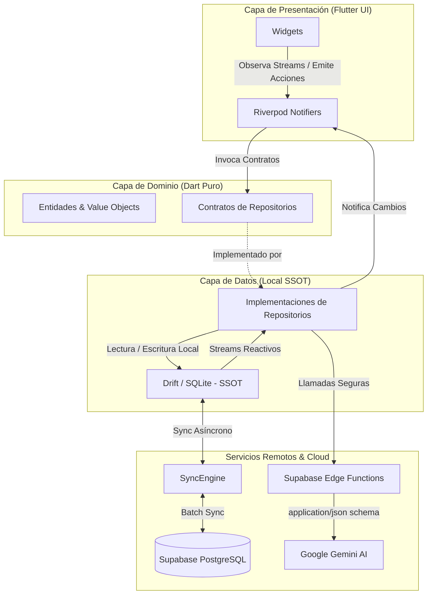
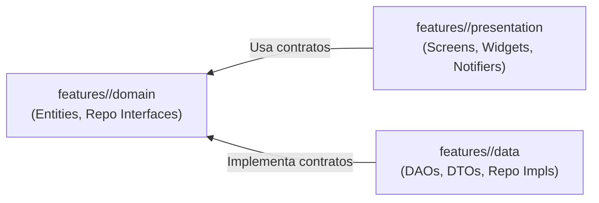

# Vie - Arquitectura del Sistema y Estándares de Ingeniería

> **Versión:** 0.0.0  
> **Estado:** Activo / En desarrollo  
> **Plataformas objetivo:** Android (mediante Flutter)

---

## 1. Visión Arquitectónica General

Vie está diseñada como un **Monolito Modular Offline-First** para la gestión personal y seguimiento de hábitos. El sistema garantiza una respuesta visual inmediata (**0 ms de latencia por red**) utilizando **SQLite** como almacenamiento primario local, sincronización asíncrona en la nube con **Supabase (PostgreSQL)** y procesamiento inteligente mediante la API de **Google Gemini**.

### Flujo de Arquitectura del Sistema



- **Capa de Presentación (UI Flutter):** Widgets y Notifiers de Riverpod. Observa Streams y emite acciones hacia el Dominio.
- **Capa de Dominio (Dart Puro):** Entidades, Value Objects y Contratos de Repositorios.
- **Capa de Datos y Motor Local:** SQLite (Drift) como Fuente Única de Verdad (SSOT).
- **Servicios Remotos:** Sincronización asíncrona hacia Supabase (PostgreSQL) y llamadas seguras de IA mediante Supabase Edge Functions con esquemas JSON estructurados hacia Gemini.

---

## 2. Stack Tecnológico y Servicios Externos

| Componente                     | Tecnología / Solución                       | Descripción y Rol                                                                       |
| :----------------------------- | :------------------------------------------ | :-------------------------------------------------------------------------------------- |
| **Cliente Base**               | Flutter (Dart 3.x+)                         | Multiplataforma (Android/iOS) con motor Impeller / Skia                                 |
| **Gestión de Estado**          | Riverpod 2.x                                | Generación con `@riverpod` / Notifiers modernos                                         |
| **Persistencia Local (SSOT)**  | SQLite + Drift                              | Consultas tipadas, streams reactivos y migraciones versionadas                          |
| **Nube & Autenticación**       | Supabase SDK                                | PostgreSQL con políticas de seguridad por fila (RLS)                                    |
| **Orquestación de IA**         | Google Gemini Pro / Flash                   | Consultado vía Supabase Edge Functions (TS/Deno) con esquema forzado `application/json` |
| **Servicios en Segundo Plano** | `flutter_foreground_task` + Alarmas nativas | Notificación persistente interactiva y alarmas nativas (`SCHEDULE_EXACT_ALARM`)         |

---

## 3. Estructura de Carpetas del Monorepo

```plaintext
vie/
├── app/                                  # Cliente móvil (Flutter)
│   ├── lib/
│   │   ├── core/                         # Elementos transversales compartidos
│   │   │   ├── database/                 # Conexión SQLite, DAOs base y esquemas Drift
│   │   │   ├── network/                  # Cliente Supabase y monitor de conectividad
│   │   │   ├── services/                 # Foreground tasks, reproductor de audio, alarmas
│   │   │   ├── theme/                    # Tokens de diseño, colores y widgets atómicos
│   │   │   └── utils/                    # Helpers de fechas, formateadores y extensiones
│   │   ├── features/                     # Módulos verticales independientes (Slices)
│   │   │   ├── exercise/                 # Módulo 1: Fitness y Rutinas (MVP)
│   │   │   │   ├── data/                 # Datasources, DTOs/Modelos, Implementación Repos
│   │   │   │   ├── domain/               # Entidades, Value Objects, Contratos de Repositorios
│   │   │   │   └── presentation/         # Controladores (Notifiers), Pantallas, Widgets locales
│   │   │   ├── daily_routines/           # (Futuro) Módulo 2: Rutina Diaria y Bloques
│   │   │   ├── projects/                 # (Futuro) Módulo 3: Proyectos y Pendientes
│   │   │   ├── finances/                 # (Futuro) Módulo 4: Gastos y Suscripciones
│   │   │   └── learning/                 # (Futuro) Módulo 5: Habilidades y Cursos
│   │   └── main.dart                     # Entrada de la app e inicialización de servicios
│   ├── test/                             # Pruebas unitarias, de widgets e integración
│   └── pubspec.yaml                      # Dependencias de Flutter
├── supabase/                             # Entorno local de Supabase (manejado por CLI)
│   ├── functions/
│   │   └── gemini-proxy/                 # Edge Functions en Deno/TS para llamadas seguras a Gemini
│   ├── migrations/                       # Scripts SQL versionados (Tablas, RLS, Triggers)
│   └── seed.sql                          # Datos base para pruebas locales
└── docs/                                 # Documentación de producto e ingeniería
    ├── ARCHITECTURE.md                   # Este archivo de arquitectura
    └── features/
        └── exercise.md                   # Requisitos y flujos detallados del módulo
```

---

## 4. Separación de Capas y Dirección de Dependencias

Cada módulo implementa un modelo estricto de **Clean Architecture** orientado a Features (_Vertical Slices_):



### 4.1 Dominio (`features/<modulo>/domain`)

- **Cero dependencias de Flutter:** Dart puro.
- **Contenido:** Contiene entidades inmutables y las interfaces abstractas de repositorios.
- > [!CAUTION]
  > **Prohibido:** Importar Riverpod, Drift, Supabase o elementos de Flutter UI (`widgets`, `material`, `cupertino`).

### 4.2 Datos (`features/<modulo>/data`)

- **Implementación:** Implementa las interfaces de repositorio del dominio.
- **Interacción:** Interactúa con la base de datos local (Drift DAOs) y endpoints remotos (Supabase).
- **Mapeo:** Mapea modelos de persistencia o respuestas JSON (DTOs) hacia entidades puras de dominio.

### 4.3 Presentación (`features/<modulo>/presentation`)

- **Contenido:** Contiene la interfaz gráfica (`Screens`, `Widgets`) y controladores de estado (`Notifiers`).
- **Comunicación:** Únicamente puede comunicarse con el sistema mediante contratos del dominio gestionados por Riverpod.
- > [!CAUTION]
  > **Prohibido:** Consultas directas a tablas de Drift, llamadas directas al cliente Supabase o inicialización de servicios nativos dentro de widgets.

---

## 5. Convenciones y Estándares de Código

### 5.1 Lenguaje e Idioma

- **Código Fuente:** Estrictamente en **inglés** para nombres de archivos, clases, métodos, variables, tests, columnas SQL y mensajes de commits.
- **Textos para el Usuario (UI):** En **español** mediante constantes centralizadas o archivos de internacionalización.

### 5.2 Límites de Tamaño y Código Limpio

- **Límite de Archivos:** Máximo **200 líneas** de código. Si un archivo excede este límite, debe dividirse en sub-widgets o utilidades.
- **Límite de Métodos:** Máximo **30 líneas** de código. Cada función debe tener una sola responsabilidad clara.
- **Profundidad de Widgets:** Máximo **4 niveles** de anidación estructural dentro de cualquier método `build()`. Los niveles adicionales deben extraerse como widgets privados (`_WorkoutTile`) o ubicarse en `presentation/widgets/`.
- > [!IMPORTANT]
  > **Prohibida la Lógica en UI:** El método `build()` debe ser puramente declarativo; no debe contener lógica de negocio, mutaciones directas de bases de datos ni cálculos pesados.

### 5.3 Nomenclatura

| Elemento                | Formato / Convención                                                       | Ejemplo                                    |
| :---------------------- | :------------------------------------------------------------------------- | :----------------------------------------- |
| **Archivos y Carpetas** | `snake_case.dart`                                                          | `workout_session_controller.dart`          |
| **Clases y Enums**      | `UpperCamelCase`                                                           | `ActiveWorkoutScreen`, `SyncStatus`        |
| **Métodos y Variables** | `lowerCamelCase`                                                           | `calculateTotalVolume()`, `activeSetIndex` |
| **Constantes**          | `lowerCamelCase` o `SCREAMING_SNAKE_CASE` (solo vars de entorno estáticas) | `defaultRestSeconds`, `API_URL`            |

#### Sufijos Obligatorios

| Tipo                              | Sufijo / Patrón                          | Ejemplo                      |
| :-------------------------------- | :--------------------------------------- | :--------------------------- |
| **Entidades**                     | `*Entity` o nombre representativo limpio | `ExerciseEntity`, `Exercise` |
| **Modelos / DTOs**                | `*Model`                                 | `ExerciseModel`              |
| **Repositorios (Interfaz)**       | `*Repository`                            | `WorkoutRepository`          |
| **Repositorios (Implementación)** | `*RepositoryImpl`                        | `WorkoutRepositoryImpl`      |
| **Controladores / Estado**        | `*Controller` o `*Notifier`              | `WorkoutSessionController`   |
| **Pantallas**                     | `*Screen`                                | `WorkoutHomeScreen`          |

---

## 6. Manejo de Estado (Riverpod 2.x)

- **Patrón de Controladores:** Cada pantalla interactiva debe poseer un `Notifier` o `AsyncNotifier` asignado.
- **Inmutabilidad del Estado:** Todos los estados deben ser clases inmutables con soporte de copia profunda (`copyWith` o `@freezed`).
- **Flujos Asíncronos:** Las operaciones de lectura/escritura deben exponerse a través de `AsyncValue<T>` para forzar el control explícito de estados de carga, error y datos listos.
- **Separación de Llamadas:**
  - La UI invoca eventos mediante:
    ```dart
    ref.read(provider.notifier).action();
    ```
  - La UI reacciona a cambios visuales únicamente con:
    ```dart
    ref.watch(provider);
    ```

---

## 7. Estrategia Offline-First y Persistencia Local

### 7.1 Escrituras Locales Inmediatas (SSOT)

- Toda mutación iniciada por el usuario impacta primero y de forma síncrona en SQLite.
- Los registros en base de datos deben incluir un campo `sync_status` con valores `'synced'`, `'pending'` o `'failed'`.
- La UI observa streams reactivos de Drift (`watch()`), actualizando los componentes de inmediato sin esperar confirmación del servidor.

### 7.2 Sincronización en Segundo Plano

- El servicio `SyncEngine` en `core/services/` escucha cambios en la conectividad del dispositivo.
- Al detectar red activa, consulta los registros en estado `'pending'`, los despacha en lote a Supabase y actualiza su estado local a `'synced'`.
- **Resolución de Conflictos:** _Last-Write-Wins_ (LWW) basándose en la columna `updated_at` en formato UTC ISO-8601.

---

## 8. Servicios Nativos y Ejecución en Segundo Plano

- **Aislamiento de Infraestructura:** Temporizadores en tiempo real, Foreground Services de Android y llamadas al gestor de alarmas deben encapsularse dentro de `core/services/`.
- **Persistencia de la Sesión en Curso:**
  - El estado del entrenamiento activo debe guardarse en SQLite cada vez que se finaliza una serie.
  - Si el sistema operativo destruye la app en segundo plano, el inicio siguiente debe detectar la sesión activa y permitir reanudarla en el mismo punto exacto.
- **Notificaciones Interactivas:** Las acciones de la notificación multimedia (`PAUSAR_TIEMPO`, `+30S_DESCANSO`, `SIGUIENTE_SERIE`) envían órdenes directas al servicio en segundo plano sin forzar la apertura de la app en primer plano.

---

## 9. Integración con Gemini y Manejo de IA

- **Proxy Seguro:** Ninguna clave de API de Gemini debe residir en el código fuente de Flutter. Las peticiones complejas se despachan hacia Supabase Edge Functions (`supabase/functions/gemini-proxy`).
- **Salida Estrictamente Estructurada:** Toda solicitud enviada a Gemini debe configurarse con `response_mime_type: "application/json"` y un `JSON Schema` validado.
- **Resiliencia en el Cliente:** La app móvil debe procesar las respuestas con serializadores defensivos. Si la deserialización falla, debe reintentar una única vez o recurrir a una plantilla local de respaldo sin que la aplicación se congele o cierre inesperadamente.

---

## 10. Definición de Terminado (Definition of Done - DoD)

Antes de considerar una tarea o módulo como finalizado, se debe verificar el siguiente checklist:

- [ ] El comando `flutter analyze` finaliza sin errores, advertencias o lints pendientes.
- [ ] Los archivos respetan el límite de **200 líneas** y los métodos el límite de **30 líneas**.
- [ ] No existen importaciones de base de datos ni de paquetes de red dentro de `presentation/`.
- [ ] Las entidades de dominio y los modelos de estado son inmutables.
- [ ] Las tablas de Drift incluyen `created_at`, `updated_at` y `sync_status`.
- [ ] Todos los métodos asíncronos manejan excepciones mediante tipos estructurados de fallo (`Failure`) legibles.
